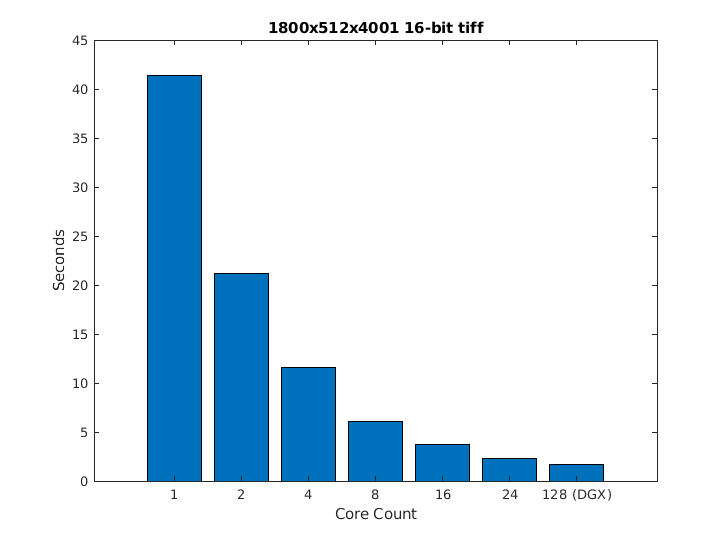

# parallelReadTiff

An optimized and efficient parallel tiff reader that utilizes LibTIFF and OpenMP.

parallelReadTiff supports 8 bit, 16 bit, single-precision, and double-precision images.

# Read Time Comparison

NOTE: CPU used for the 1,2,4,8,16,24 core tests is a dual Intel(R) Xeon(R) Gold 6146 CPU @ 3.20GHz 
